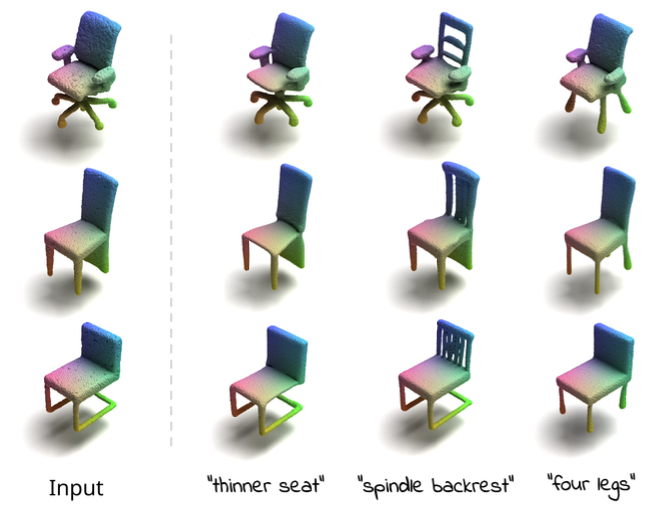

# Blended Point Cloud Diffusion for Localized Text-Guided Shape Editing

**Etai Sella<sup>1</sup>, Noam Atia<sup>1</sup>, Ron Mokady<sup>1</sup>, Hadar Averbuch-Elor<sup>1,2</sup>**

<sup>1</sup> Tel Aviv University  <sup>2</sup> Cornell University  

This is the official PyTorch implementation of **BlendedPC**.

[](https://arxiv.org/abs/2311.17834)  
[[Project Website](https://tau-vailab.github.io/BlendedPC/)]

## Abstract

Natural language offers a highly intuitive interface for enabling localized, fine-grained edits of 3D shapes. However, prior works face challenges in preserving global coherence while locally modifying the input 3D shape.

We introduce an **inpainting-based framework** for editing shapes represented as point clouds. Our approach leverages foundation 3D diffusion models for localized shape edits, adding structural guidance through partial conditional shapes to preserve global identity. To enhance identity preservation within edited regions, we propose an **inference-time coordinate blending algorithm**. This algorithm balances reconstruction of the full shape with inpainting over progressive noise levels, enabling seamless blending of original and edited shapes without requiring costly and inaccurate inversion.

Extensive experiments demonstrate that our method outperforms existing techniques across multiple metrics, measuring both fidelity to the original shape and adherence to textual prompts.

We will release our code and trained models.

<p align="center">

</p>

---

## Getting Started

### Clone the Repository

```bash
git clone git@github.com:TAU-VAILab/BlendedPC.git
cd BlendedPC
```

### Set Up the Environment

```bash
conda create --name blended-pc -y python=3.11
conda activate blended-pc
pip install -e .
```

---

## Running the Demo

Run the one of the following commands to test the model:

```bash
python run_inference.py --prompt "thinner legs" --shape_category chair --input_uid "chair/ShapeNet/4c97f421c4ea4396d8ac5d7ad0953104" --part leg
```

```bash
python run_inference.py --prompt "thicker top" --shape_category table --input_uid "table/ShapeNet/a3ecb4d209807312492d9da2668ec34c" --part top
```

```bash
python run_inference.py --prompt "rounded base" --shape_category lamp --input_uid "lamp/ShapeNet/aa6cdecffb9d4e403ec7ad443e0ae81e" --part base
```

Model checkpoints are automatically downloaded from the Hugging Face Hub by default.

**Expected Outputs:**

- `input.png`: The original input shape
- `copy.png`: Output of the model using the "copy" prompt
- `masked.png`: Input shape with masked regions
- `output.png`: Final output after editing

---

## Using Other Shapes from ShapeTalk

Download the ShapeTalk dataset from [here](https://changeit3d.github.io/#dataset).  
Then run the script with your desired parameters:

```bash
python run_inference.py --prompt <YOUR-PROMPT> --shape_category <SHAPE-CATEGORY> --input_uid <INPUT-UID> --part <SHAPE-PART> --shapetalk_dir <SHAPETALK-DIR>
```

---

## Training a Model

Coming soon...

---

## Citation

If you find our work useful, please consider citing:

```bibtex
@article{sella2023spic,
  title={Spice-E : Structural Priors in 3D Diffusion using Cross-Entity Attention},
  author={Etai Sella and Gal Fiebelman and Noam Atia and Hadar Averbuch-Elor},
  year={2024},
  eprint={2311.17834},
  archivePrefix={arXiv},
  primaryClass={cs.CV}
}
```

---

## Acknowledgements

We thank the authors of [Point-E](https://github.com/openai/point-e) for their outstanding codebase, which served as a foundation for this project.
