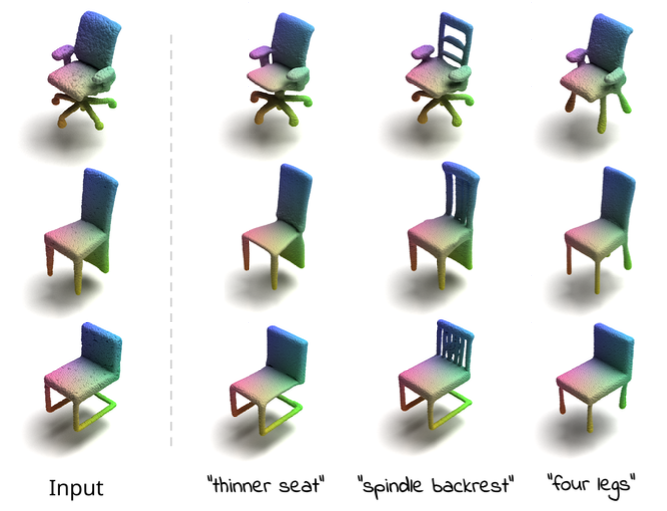

# Blended Point Cloud Diffusion for Localized Text-Guided Shape Editing

**Etai Sella<sup>1</sup>, Noam Atia<sup>1</sup>, Ron Mokady<sup>2</sup>, Hadar Averbuch-Elor<sup>3</sup>**

<sup>1</sup> Tel Aviv University  <sup>2</sup> BRIA AI <sup>3</sup> Cornell University  

This is the official PyTorch implementation of **BlendedPC**.

[](https://arxiv.org/abs/2507.15399)


## 📄 Abstract

Natural language offers a highly intuitive interface for enabling localized, fine-grained edits of 3D shapes. However, prior works face challenges in preserving global coherence while locally modifying the input 3D shape.

We introduce an **inpainting-based framework** for editing shapes represented as point clouds. Our approach leverages foundation 3D diffusion models for localized shape edits, adding structural guidance through partial conditional shapes to preserve global identity. To enhance identity preservation within edited regions, we propose an **inference-time coordinate blending algorithm**. This algorithm balances reconstruction of the full shape with inpainting over progressive noise levels, enabling seamless blending of original and edited shapes without requiring costly and inaccurate inversion.

Extensive experiments demonstrate that our method outperforms existing techniques across multiple metrics, measuring both fidelity to the original shape and adherence to textual prompts.

<p align="center">

</p>

---

## 🚀 Getting Started

### Cloning the repository

```bash
git clone git@github.com:TAU-VAILab/BlendedPC.git
cd BlendedPC
```

### Setting up the environment

```bash
conda create --name blended-pc -y python=3.11
conda activate blended-pc
pip install -e .
```

---

## 🎮 Running the Demo

Run one of the following scripts to test our "chair", "lamp" or "table" models:

```bash
bash demos/chair_demo.sh 
```
```bash
bash demos/lamp_demo.sh 
```
```bash
bash demos/table_demo.sh 
```

Model checkpoints are automatically downloaded from the Hugging Face Hub by default.

**Expected Outputs:**

- `input.png`: The original input shape
- `reconstruction.png`: Output of the model using the "copy" prompt
- `masked.png`: Input shape with masked regions
- `output.png`: Final output after editing

---

## 🪑 Using other shapes from ShapeTalk

Download the ShapeTalk dataset from [here](https://changeit3d.github.io/#dataset).  
Then run the script with your desired parameters:

```bash
python run_inference.py --prompt <YOUR-PROMPT> --shape_category <SHAPE-CATEGORY> --input_path <INPUT-PATH> --part <SHAPE-PART>
```

Please refer to the previously mentioned demo scripts for examples on how to set these arguments.

---

## 🏋️ Training a Model

The training script finetunes a pretrained Point-E diffusion model on [ShapeTalk](https://changeit3d.github.io/#dataset) editing pairs. It uses classifier-free guidance with a copy-reconstruction auxiliary objective.

### Prerequisites

1. Download the ShapeTalk dataset from [here](https://changeit3d.github.io/#dataset).
2. Dataset CSV splits (`train.csv`, `test.csv`) are included in the repo under `datasets/v1/<category>/`.

### Quick Start

A ready-to-run script is provided for the chair category:

```bash
bash demos/train_chair.sh
```

Or run the training script directly:

```bash
python finetune.py --object chair --shapetalk_dir /path/to/shapetalk --output_dir /path/to/output
```

Run `python finetune.py --help` to see all available arguments and their defaults.

### Outputs

Each run creates a timestamped directory under `--output_dir` containing:

```
<run_name>/
├── args.json            # All command-line arguments for this run
├── train_loss.png       # Training loss curve
├── test_loss.png        # Test loss curve (evaluated on the full test set)
├── loss.csv             # Per-epoch loss values (train + test)
├── checkpoints/         # Model weights saved every --val_freq epochs
└── samples/
    ├── val/             # Rendered grids from training subset
    │   ├── reference.png
    │   └── epoch_*.png
    └── test/            # Rendered grids from held-out test samples
        ├── reference.png
        └── epoch_*.png
```

Each rendered grid shows four columns per sample: **source input → edit output → target input → copy output**.

### Caching

Processed samples (segmentation masks and encoded latents) are cached in `/tmp/blendedpc_cache/` for fast reloading on subsequent runs. If you change the masking or encoding logic, clear the cache:

```bash
rm -rf /tmp/blendedpc_cache
```

---

## 📝 Citation

If you find our work useful, please consider citing:

```bibtex
@misc{sella2025blendedpointclouddiffusion,
      title={Blended Point Cloud Diffusion for Localized Text-guided Shape Editing}, 
      author={Etai Sella and Noam Atia and Ron Mokady and Hadar Averbuch-Elor},
      year={2025},
      eprint={2507.15399},
      archivePrefix={arXiv},
      primaryClass={cs.GR},
      url={https://arxiv.org/abs/2507.15399}, 
}
```

---

## 🙏 Acknowledgements

We thank the authors of [Point-E](https://github.com/openai/point-e) for their outstanding codebase, which served as a foundation for this project.
